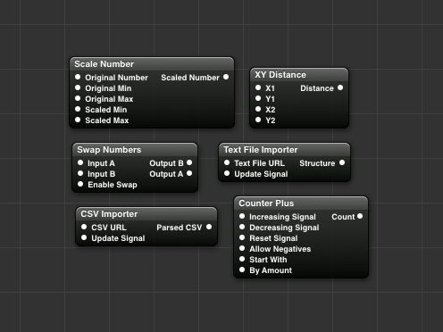
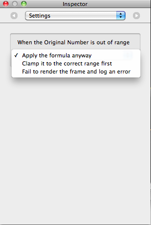

# rdqcutils

This is a collection of custom patches that I created from Quartz Composer. It includes Swap Numbers, CSV Importer, Text File Importer, Counter Plus, and Scale Number. CSV Importer uses Dave DeLong's excellent CHCSVParser library. This is an old project of mine and is unlikely to be updated, but it still seems to work fine on my El Capitan isntallation.

Quartz Composer plugin that provides handy utility patches

## Description

* **Swap Numbers** - Swap two numbers, or not.
* **Scale Number** - Scale a number up or down, from one min-max range to another. The patch settings determine the behavior when the original number is outside the specified original min-max range. The Range patch can also be a handy partner.
* **CSV Importer** - Imports a CSV (comma-delimited) text file from a URL and outputs a structure of structures, containing rows of fields. Local files can be imported by specifying a `file://` URL (Remember that an absolute path will have 3 slashes at its start eg: `file:///Users/bill/delimited.txt`) The import occurs every time the Update Signal input goes from LOW to HIGH.
* **Text File Importer** - Imports a plain text file from a URL and outputs a structure containing one member per line. Local files can be imported by specifying a `file://` URL (Remember that an absolute path will have 3 slashes at its start eg: `file:///Users/bill/plain.txt`). The structure's numerical indices are not necessarily in order. To retrieve the lines in order, use the structure keys and not the indices. The import occurs every time the Update Signal input goes from LOW to HIGH.
* **Counter Plus** - Like the normal counter, but allows for optionally decrementing below zero. You can also specify a starting number and an amount by which to increment or decrement.
* **XY Distance** - Calculates the distance between two sets of Cartesian (X and Y) coordinates. Works with pixels or units.

## Installation

Install rdqcutils by unzipping the file and dropping the resulting plugin into your `~/Library/Graphics/Quartz Composer Plug-Ins` folder (where `~` is your Home directory). Create that folder if it doesn't already exist. The patches should now show up under Plugins in Quartz Composer's Library window.

## Note

If you already have an older (pre-1.2) version of the plugin, please note that I changed the name of the plugin slightly (added underscores and removed the 
version number from the plugin filename). If you have an older version (before 1.2) you'll need to 
remove the old one before installing this newest version.

## Screenshots

##### Patches contained in the plugin:

##### The settings panel of the Scale Number patch:

